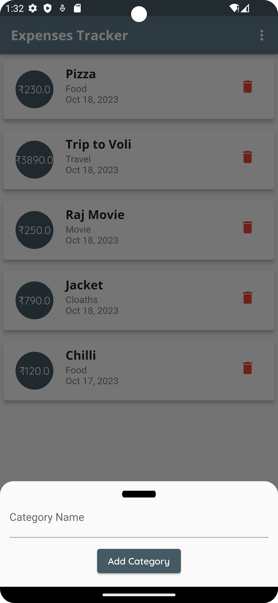

# Expense-Tracker-App

Simple Expense Manager app

## Description

This app is designed in Flutter and helps to manage expenses in a simple way

## Screenshots

  
  
  
  
   

## Features
  - Expense Dashboard
  - Add Expenses
  - Delete Expenses
  - Manage Categories
  - Profile

## Authors

Contributors names and contact info
Sandeep
sandeep.k.satpute@gmail.com
